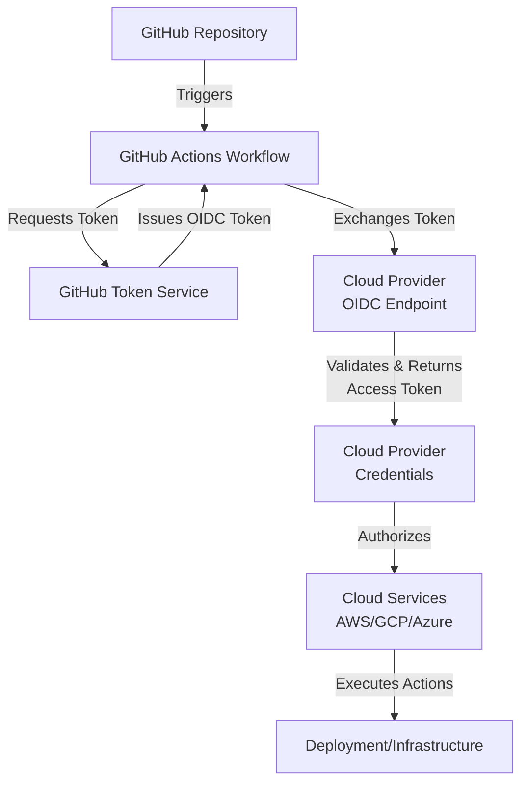

# Security-First CI/CD with Gemini & Workload Identity Federation

## Overview
This project provides a robust, AI-powered security and compliance pipeline integrated directly into GitHub Actions. It leverages the **Gemini CLI** for intelligent code analysis and **Google Cloud Workload Identity Federation (WIF)** for secure, keyless authentication to GCP. The pipeline automatically scans every pull request and commit for security vulnerabilities, PII (Personally Identifiable Information) leaks, and dependency risks before allowing code to be deployed.

## Problems It Solves
*   **Static Analysis Limitations:** Traditional linting often misses complex logic flaws. This pipeline uses Gemini's GenAI capabilities to perform deep, contextual security reviews.
*   **Credential Sprawl:** Eliminates the need for long-lived Service Account JSON keys by using OIDC tokens, significantly reducing the risk of credential theft.
*   **Accidental Data Exposure:** Automates the detection of PII (emails, phone numbers, locations) using Google Cloud DLP, preventing sensitive data from reaching production logs or databases.
*   **Manual Review Bottlenecks:** Provides automated PR reviews and quality gate decisions, allowing security teams to focus on high-impact strategic work rather than repetitive checks.

## Why Use It?
*   **Automated Quality Gates:** Enforces strict security standards (Zero "High" severity issues) automatically.
*   **Auditability:** Every scan generates detailed reports that are archived in Google Cloud Storage for compliance and post-mortem analysis.
*   **Seamless Integration:** Designed to work out-of-the-box with GitHub Actions and Google Cloud Run.
*   **AI-Driven Insights:** Goes beyond pattern matching to understand the *intent* and *impact* of code changes.

## Target Audience
*   **Security Engineers:** Looking to automate "shift-left" security practices and scale their impact.
*   **DevOps/SRE Teams:** Aiming to build secure, keyless deployment pipelines with built-in quality gates.
*   **Compliance Officers:** Needing automated evidence collection and consistent enforcement of data privacy rules.
*   **Software Developers:** Wanting immediate, actionable feedback on security and PII risks within their PRs.

## Security PII and Code Review Pipeline

## OIDC Auth To GCP

