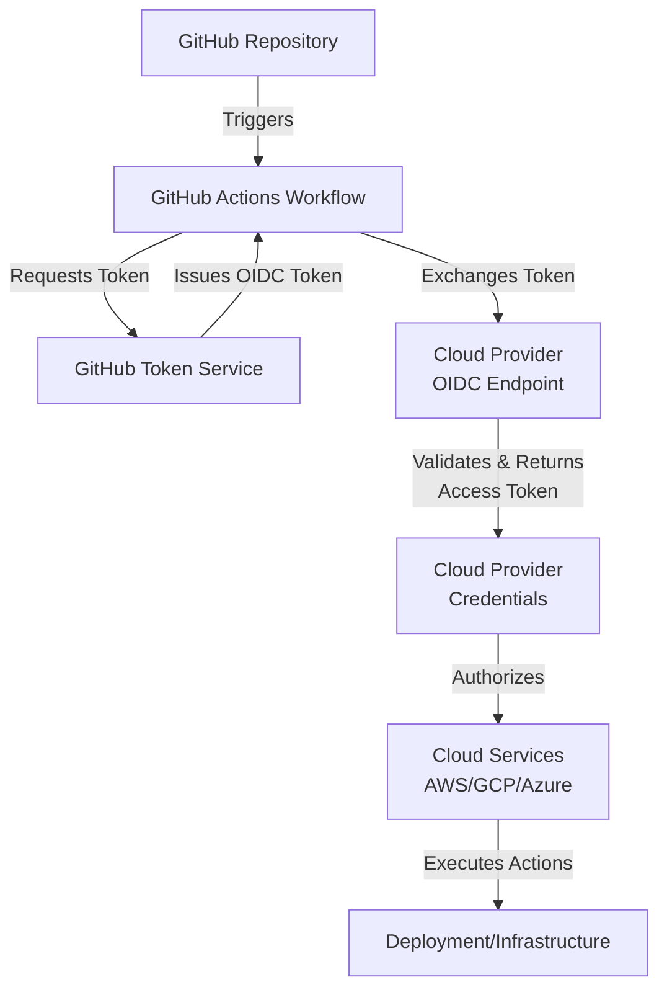

# e2e-agent-patterns

## Github Actions Architecture Diagram

```mermaid
graph TD
    A["GitHub Repository"] -->|Triggers| B["GitHub Actions Workflow"]
    B -->|Requests Token| C["GitHub Token Service"]
    C -->|Issues OIDC Token| B
    B -->|Exchanges Token| D["Cloud Provider<br/>OIDC Endpoint"]
    D -->|Validates & Returns<br/>Access Token| E["Cloud Provider<br/>Credentials"]
    E -->|Authorizes| F["Cloud Services<br/>AWS/GCP/Azure"]
    F -->|Executes Actions| G["Deployment/Infrastructure"]
```

