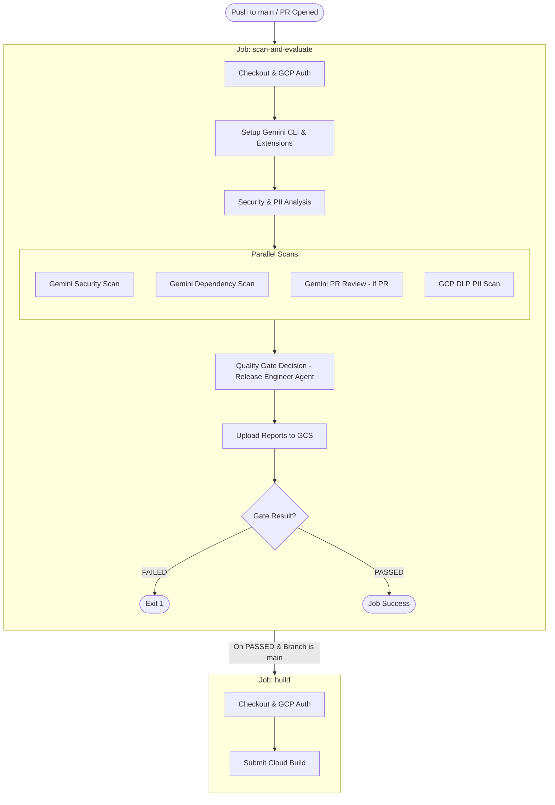
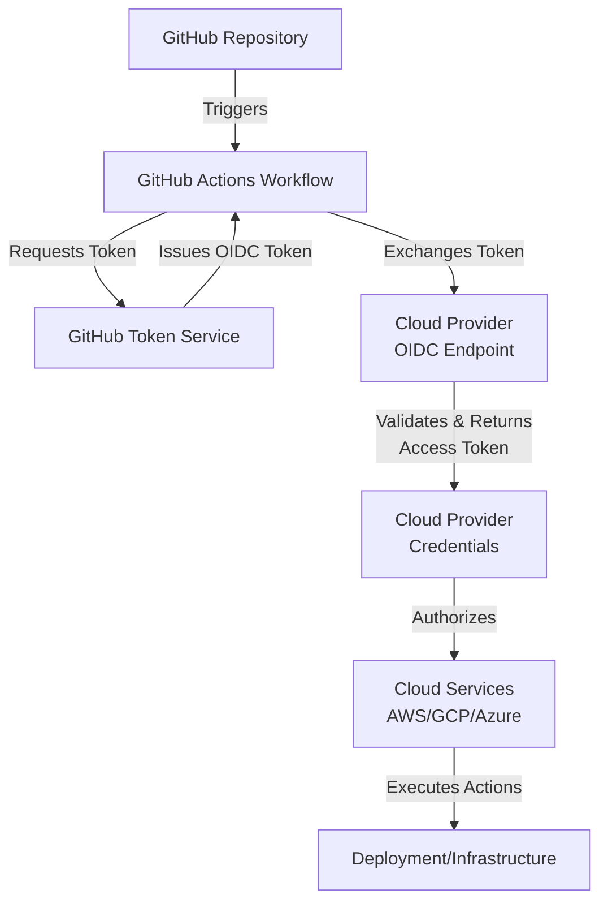

## Security PII and Code Review Pipeline

```mermaid
flowchart TD
    Trigger([Push to main / PR Opened]) --> Job1[Job: scan-and-evaluate]
    
    subgraph Job1 [Job: scan-and-evaluate]
        direction TB
        S1[Checkout & GCP Auth] --> S2[Setup Gemini CLI & Extensions]
        S2 --> S3[Security & PII Analysis]
        
        subgraph Scans [Parallel Scans]
            direction TB
            SS1[Gemini Security Scan]
            SS2[Gemini Dependency Scan]
            SS3[Gemini PR Review - if PR]
            SS4[GCP DLP PII Scan]
        end
        
        S3 --> Scans
        Scans --> S4[Quality Gate Decision - Release Engineer Agent]
        S4 --> S5[Upload Reports to GCS]
        S5 --> S6{Gate Result?}
        S6 -- FAILED --> S7([Exit 1])
        S6 -- PASSED --> S8([Job Success])
    end
    
    Job1 -->|On PASSED & Branch is main| Job2[Job: build]
    
    subgraph Job2 [Job: build]
        direction TB
        B1[Checkout & GCP Auth] --> B2[Submit Cloud Build]
    end
```

## OIDC Auth To GCP

```mermaid
graph TD
    A["GitHub Repository"] -->|Triggers| B["GitHub Actions Workflow"]
    B -->|Requests Token| C["GitHub Token Service"]
    C -->|Issues OIDC Token| B
    B -->|Exchanges Token| D["Cloud Provider<br/>OIDC Endpoint"]
    D -->|Validates & Returns<br/>Access Token| E["Cloud Provider<br/>Credentials"]
    E -->|Authorizes| F["Cloud Services<br/>AWS/GCP/Azure"]
    F -->|Executes Actions| G["Deployment/Infrastructure"]
```
